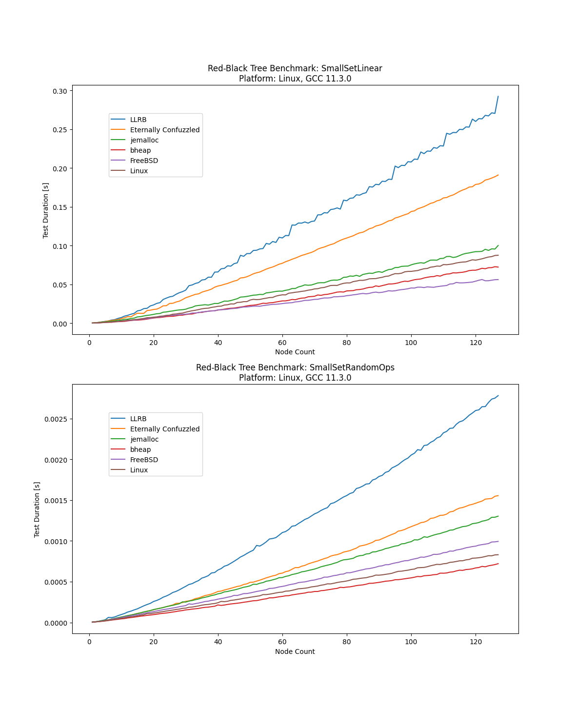

# Red-Black Tree Implementation Benchmark

The following implementations are tested

* [FreeBSD](https://github.com/freebsd/freebsd-src/blob/main/sys/sys/tree.h)
* [Eternally Confuzzled](http://eternallyconfuzzled.com/tuts/datastructures/jsw_tut_rbtree.aspx)
* [jemalloc](https://github.com/jemalloc/jemalloc/blob/dev/include/jemalloc/internal/rb.h)
* [Left-Leaning](http://www.25thandclement.com/~william/projects/llrb.h.html)
* [Linux](https://github.com/torvalds/linux/blob/master/include/linux/rbtree.h)

The test program produces an XML file.  Use the plot.py script to print some
diagrams.

Some sample reports:

