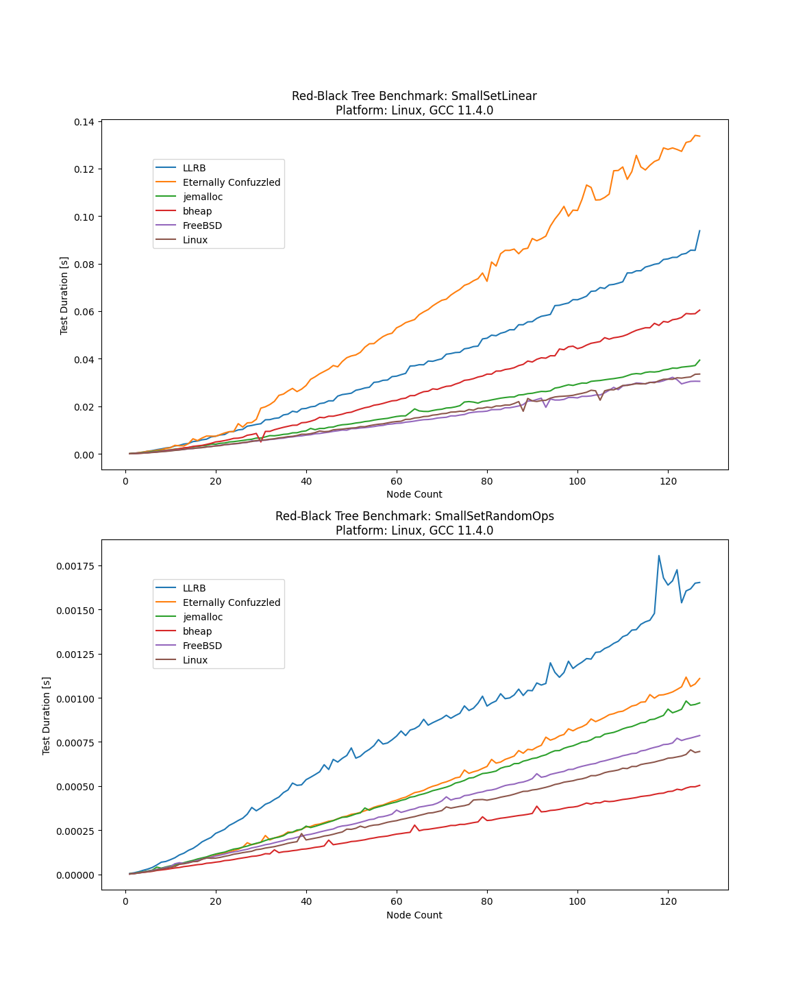

# Red-Black Tree Implementation Benchmark

The following implementations are tested

* [BSD](https://github.com/freebsd/freebsd/blob/master/sys/sys/tree.h)
* [Eternally Confuzzled](http://eternallyconfuzzled.com/tuts/datastructures/jsw_tut_rbtree.aspx)
* [Jason Evans - Newer](http://www.canonware.com/download/rb/rb_newer/)
* [Jason Evans - New](http://www.canonware.com/download/rb/rb_new/)
* [Jason Evans - Old](http://www.canonware.com/download/rb/rb_old/)
* [Left-Leaning](http://www.25thandclement.com/~william/projects/llrb.h.html)
* [Linux](https://github.com/torvalds/linux/blob/master/include/linux/rbtree.h)

The test program produces an XML file.  Use the plot.py script to print some
diagrams.

Some sample reports:

